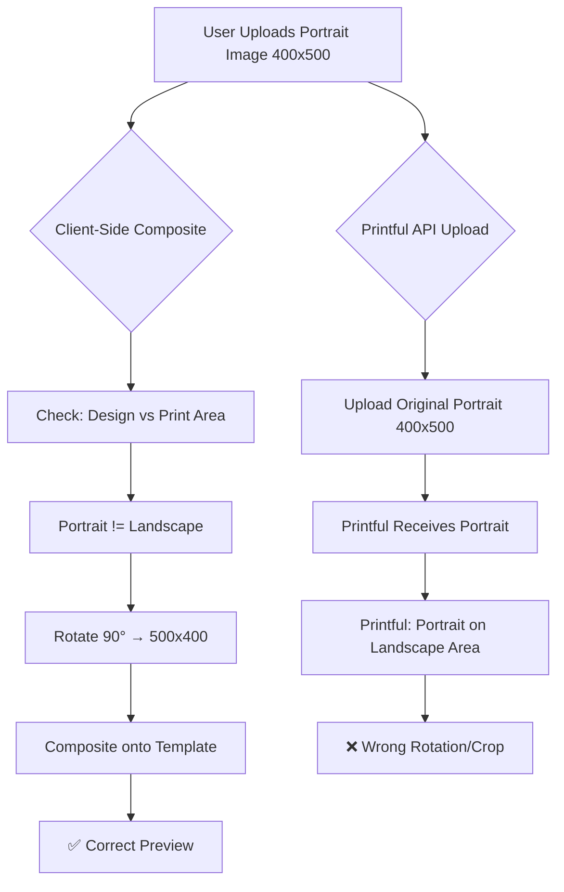

# Complete Solution: Tapestry Rotation Issue

## Problem Summary

The tapestry product has TWO related but distinct rotation issues:

### Issue 1: Client-Side Composite ✅ FIXED
- **Problem**: Database had wrong print area orientation (portrait instead of landscape)
- **Solution**: Updated database with correct landscape print area values
- **Status**: Fixed - client-side composite now works correctly

### Issue 2: Official Printful Preview ❌ STILL BROKEN
- **Problem**: Images uploaded to Printful are not rotated to match print area orientation
- **Result**: Printful receives portrait image for landscape print area, causing rotation/cropping issues
- **Status**: Needs fix

## Root Cause Analysis

### The Two Rotation Points



### Why This Happens

**Client-Side (FrameMockupRenderer):**
- Rotates image in-browser before compositing
- Works correctly because it knows the print area orientation
- Result: Correct preview

**Server-Side (Printful Upload):**
- Uploads original image without rotation
- Printful doesn't know our rotation logic
- Printful tries to fit portrait image into landscape area
- Result: Wrong orientation

## Solution Design

### Option 1: Rotate Image Before Upload (Recommended)

Modify the upload flow to rotate images when design orientation doesn't match print area orientation.

**Flow:**
1. User uploads design image
2. Server fetches variant's print area from database
3. Server detects design orientation and print area orientation
4. If orientations differ, rotate image 90° using Sharp
5. Upload rotated image to Printful
6. Return Printful file ID

**Pros:**
- Printful receives correctly oriented image
- Works for all products automatically
- Consistent with client-side logic

**Cons:**
- Adds processing time to upload
- Requires Sharp image manipulation

### Option 2: Use Printful's Rotation Parameter

Check if Printful API supports rotation parameters in mockup generation.

**Pros:**
- No image processing needed
- Faster upload

**Cons:**
- May not be supported by Printful API
- Less control over final result

### Option 3: Pre-rotate on Client Side

Rotate image in browser before uploading.

**Pros:**
- No server-side processing
- User sees what will be uploaded

**Cons:**
- Duplicates rotation logic
- Larger upload size (rotated image)
- More complex client code

## Recommended Implementation: Option 1

### Step 1: Modify Upload Route

Update [`app/api/printful/upload/route.ts`](app/api/printful/upload/route.ts) to:

1. Accept `variant_id` parameter
2. Fetch variant's print area from database
3. Download the image from the provided URL
4. Detect image dimensions
5. Compare orientations
6. Rotate if needed using Sharp
7. Upload to Printful

**New API signature:**
```typescript
POST /api/printful/upload
{
  "url": "https://...",
  "variant_id": 33974  // NEW: Required for orientation detection
}
```

### Step 2: Add Rotation Logic

```typescript
import sharp from 'sharp';

async function rotateImageIfNeeded(
  imageBuffer: Buffer,
  variantId: number
): Promise<Buffer> {
  // 1. Get variant print area from database
  const { data: variant } = await supabase
    .from('product_variants')
    .select('mockup_print_area')
    .eq('id', variantId)
    .single();
  
  if (!variant?.mockup_print_area) {
    return imageBuffer; // No rotation if print area unknown
  }
  
  const printArea = typeof variant.mockup_print_area === 'string'
    ? JSON.parse(variant.mockup_print_area)
    : variant.mockup_print_area;
  
  // 2. Get image dimensions
  const metadata = await sharp(imageBuffer).metadata();
  const designWidth = metadata.width || 0;
  const designHeight = metadata.height || 0;
  
  // 3. Determine orientations
  const designIsPortrait = designHeight > designWidth;
  const printAreaIsPortrait = printArea.height > printArea.width;
  
  // 4. Rotate if orientations differ
  if (designIsPortrait !== printAreaIsPortrait) {
    console.log(`Rotating image for variant ${variantId}: design=${designIsPortrait ? 'portrait' : 'landscape'}, printArea=${printAreaIsPortrait ? 'portrait' : 'landscape'}`);
    
    return await sharp(imageBuffer)
      .rotate(90) // Rotate 90° clockwise
      .toBuffer();
  }
  
  return imageBuffer;
}
```

### Step 3: Update Upload Flow

```typescript
export async function POST(request: Request) {
  const body = await request.json();
  const { url, variant_id } = uploadSchema.parse(body);
  
  // Download image
  const imageResponse = await fetch(url);
  const imageBuffer = Buffer.from(await imageResponse.arrayBuffer());
  
  // Rotate if needed
  const processedBuffer = await rotateImageIfNeeded(imageBuffer, variant_id);
  
  // Convert to base64 for Printful upload
  const base64Image = processedBuffer.toString('base64');
  
  // Upload to Printful
  const response = await fetch(`${PRINTFUL_API_URL}/files`, {
    method: 'POST',
    headers: {
      'Authorization': `Bearer ${API_KEY}`,
      'Content-Type': 'application/json',
    },
    body: JSON.stringify({
      role: 'printfile',
      type: 'default',
      contents: base64Image,
      filename: `user-${userId}-${Date.now()}.png`,
    }),
  });
  
  // ... rest of upload logic
}
```

### Step 4: Update Client Calls

Update all places that call `/api/printful/upload` to include `variant_id`:

**Store page:**
```typescript
const uploadResponse = await fetch('/api/printful/upload', {
  method: 'POST',
  headers: { 'Content-Type': 'application/json' },
  body: JSON.stringify({
    url: designBlobUrl,
    variant_id: selectedVariant.id  // ADD THIS
  })
});
```

**Debug mockup page:**
```typescript
// Already has variant_id available from selectedVariantId state
```

## Implementation Steps

### Phase 1: Update Upload Route
1. Add `variant_id` to upload schema
2. Add database query to fetch print area
3. Implement `rotateImageIfNeeded()` function
4. Update upload logic to use processed buffer
5. Add logging for debugging

### Phase 2: Update Client Code
1. Find all calls to `/api/printful/upload`
2. Add `variant_id` parameter to each call
3. Ensure variant_id is available in context

### Phase 3: Testing
1. Test with tapestry + portrait image (400×500)
   - Should rotate to landscape (500×400) before upload
   - Official Printful preview should be correct
2. Test with tapestry + landscape image (500×400)
   - Should NOT rotate (already matches)
   - Official Printful preview should be correct
3. Test with other products (posters, canvases)
   - Should work correctly (no regression)

### Phase 4: Validation
1. Compare client-side composite vs official Printful preview
2. Both should show identical orientation
3. No cropping or rotation artifacts

## Edge Cases to Handle

### Case 1: Square Images
- Square images (500×500) have no orientation
- Should not rotate
- Logic: `designHeight === designWidth` → no rotation

### Case 2: Print Area Unknown
- If variant has no `mockup_print_area` in database
- Should not rotate (fail safe)
- Log warning for investigation

### Case 3: Upload Fails After Rotation
- If Printful rejects rotated image
- Should retry with original image
- Log error for investigation

### Case 4: Multiple Variants in Cart
- Each variant may have different print area orientation
- Must rotate each image independently
- Ensure variant_id is passed correctly for each item

## Alternative: Printful API Options

### Check Printful Documentation

Printful's mockup generation API may support:
- `orientation` parameter
- `rotation` parameter
- `fit` parameter

**Action**: Review Printful API docs to see if rotation can be specified without pre-processing.

**If supported:**
```typescript
const task = await printful.createMockupTask({
  variant_ids: [variant_id],
  format: 'jpg',
  files: [{
    placement: 'default',
    image_url: image_url,
    rotation: needsRotation ? 90 : 0  // IF SUPPORTED
  }]
});
```

## Testing Plan

### Test Matrix

| Product | Design | Print Area | Expected Rotation | Client Preview | Printful Preview |
|---------|--------|------------|-------------------|----------------|------------------|
| Tapestry | Portrait (400×500) | Landscape (842×702) | Yes (90°) | ✅ | ❌ → ✅ |
| Tapestry | Landscape (500×400) | Landscape (842×702) | No | ✅ | ❌ → ✅ |
| Tapestry | Square (500×500) | Landscape (842×702) | No | ✅ | ❌ → ✅ |
| Poster | Portrait (400×500) | Portrait (760×840) | No | ✅ | ✅ |
| Poster | Landscape (500×400) | Portrait (760×840) | Yes (90°) | ✅ | ❓ → ✅ |

### Test Procedure

1. **Setup**: Ensure database has correct print area values
2. **Upload**: Upload test image through normal flow
3. **Preview**: Check both client composite and official Printful preview
4. **Compare**: Verify both show same orientation
5. **Order**: Place test order to verify final product

## Success Criteria

✅ Client-side composite shows correct orientation
✅ Official Printful preview shows correct orientation
✅ Both previews match exactly
✅ No cropping or rotation artifacts
✅ Works for all product types
✅ No regression on existing products

## Rollout Plan

### Phase 1: Development
- Implement rotation logic in upload route
- Add comprehensive logging
- Test locally with debug page

### Phase 2: Staging
- Deploy to staging environment
- Test with all product types
- Verify no regressions

### Phase 3: Production
- Deploy to production
- Monitor error logs
- Test with real orders

### Phase 4: Validation
- Review first few orders
- Check customer feedback
- Verify print quality

## Monitoring & Debugging

### Logging Points

1. **Upload Route**:
   - Log when rotation is applied
   - Log design dimensions
   - Log print area dimensions
   - Log rotation decision

2. **Error Tracking**:
   - Track rotation failures
   - Track upload failures after rotation
   - Track mismatched orientations

### Debug Queries

```sql
-- Find variants with landscape print areas
SELECT id, name, mockup_print_area
FROM product_variants
WHERE mockup_print_area IS NOT NULL
  AND (mockup_print_area->>'width')::float > (mockup_print_area->>'height')::float;

-- Find recent orders with tapestry
SELECT id, variant_id, design_id, created_at
FROM orders
WHERE variant_id = 33974
ORDER BY created_at DESC
LIMIT 10;
```

## Future Improvements

1. **Cache Rotated Images**: Store rotated versions to avoid re-processing
2. **Client-Side Rotation**: Rotate in browser before upload to reduce server load
3. **Automatic Detection**: Detect print area orientation from template automatically
4. **Validation UI**: Show rotation preview before upload
5. **Batch Processing**: Handle multiple images efficiently

## Related Files

- [`app/api/printful/upload/route.ts`](app/api/printful/upload/route.ts) - Upload route (needs modification)
- [`components/ecommerce/FrameMockupRenderer.tsx`](components/ecommerce/FrameMockupRenderer.tsx) - Client rotation logic (reference)
- [`app/debug/mockup/page.tsx`](app/debug/mockup/page.tsx) - Debug page (testing)
- [`app/api/checkout/route.ts`](app/api/checkout/route.ts) - Checkout flow (uses upload)
- [`lib/actions/printful.ts`](lib/actions/printful.ts) - Printful utilities

## Next Steps

1. **Implement** rotation logic in upload route
2. **Update** client code to pass variant_id
3. **Test** with tapestry product
4. **Verify** both previews match
5. **Deploy** to production
6. **Monitor** for issues
