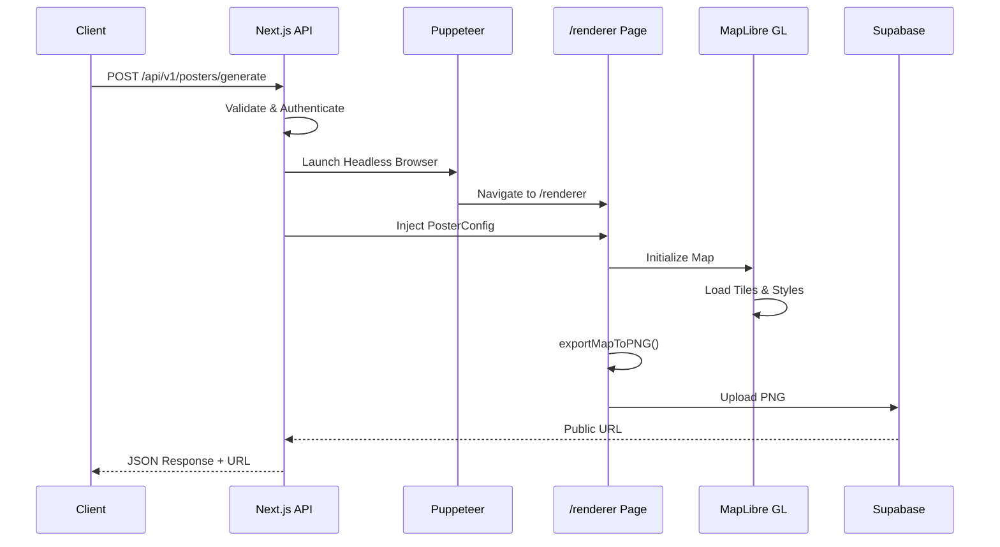
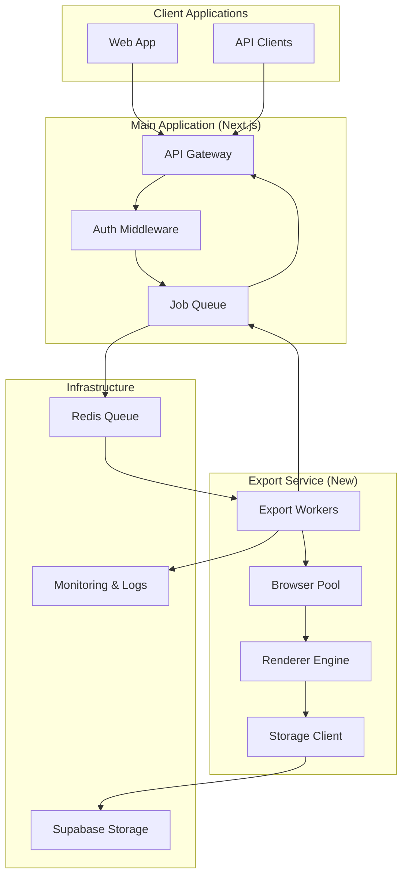

# Headless Map Image Export Server - Architecture Plan

## Executive Summary

This document outlines the architecture for extracting the map image export functionality from the main Next.js application into a dedicated headless rendering service. This separation will improve performance, scalability, and maintainability of the carto-art platform.

## Current State Analysis

### Existing Export Flow



### Key Components Identified

| Component | Location | Purpose |
|-----------|----------|---------|
| [`/api/v1/posters/generate/route.ts`](../app/api/v1/posters/generate/route.ts) | API Layer | Request handling, auth, validation |
| [`lib/rendering/renderer.ts`](../lib/rendering/renderer.ts) | Rendering Core | Puppeteer orchestration |
| [`lib/rendering/browser.ts`](../lib/rendering/browser.ts) | Browser Mgmt | Chromium instance management |
| [`app/renderer/page.tsx`](../app/renderer/page.tsx) | Renderer UI | Map rendering page for headless capture |
| [`lib/export/exportCanvas.ts`](../lib/export/exportCanvas.ts) | Export Logic | Canvas composition and PNG generation |
| [`lib/styles/`](../lib/styles/) | Style System | Map styles, palettes, typography |
| [`types/poster.ts`](../types/poster.ts) | Type Definitions | PosterConfig, ColorPalette, etc. |

### Dependencies

- **Puppeteer** + **@sparticuz/chromium**: Headless browser automation
- **MapLibre GL**: Map rendering engine
- **maplibre-contour**: Contour line generation
- **Supabase**: Storage and database
- **Custom fonts**: Typography rendering

## Proposed Architecture

### System Overview



### Service Components

#### 1. Export Service (Node.js/Express)

**Purpose**: Dedicated service for headless map rendering

**Key Responsibilities**:
- Receive export jobs from queue
- Manage Puppeteer browser instances
- Execute rendering pipeline
- Upload results to Supabase
- Report status and metrics

**Core Modules**:

```
export-service/
├── src/
│   ├── api/
│   │   ├── health.ts          # Health check endpoint
│   │   └── render.ts           # Internal render endpoint
│   ├── workers/
│   │   ├── export-worker.ts    # Main job processor
│   │   └── browser-pool.ts     # Browser instance management
│   ├── rendering/
│   │   ├── renderer.ts         # Core rendering logic (extracted)
│   │   ├── browser.ts          # Browser management (extracted)
│   │   └── renderer-page.tsx   # Renderer page (extracted)
│   ├── styles/
│   │   └── index.ts            # Style definitions (shared)
│   ├── storage/
│   │   └── supabase.ts         # Storage client
│   ├── types/
│   │   └── poster.ts           # Type definitions (shared)
│   └── index.ts                # Service entry point
├── package.json
├── Dockerfile
└── tsconfig.json
```

#### 2. Job Queue System

**Technology**: Redis + BullMQ (or similar)

**Job Schema**:

```typescript
interface ExportJob {
  id: string;
  userId: string;
  config: PosterConfig;
  resolution: {
    width: number;
    height: number;
    pixelRatio: number;
  };
  priority: 'low' | 'normal' | 'high';
  createdAt: Date;
  timeout: number; // milliseconds
}
```

**Queue Configuration**:
- **Default queue**: Standard exports
- **High-priority queue**: Premium users, API requests
- **Retry queue**: Failed jobs with exponential backoff

#### 3. Browser Pool Management

**Purpose**: Efficiently manage Chromium instances

**Strategy**:
- Pre-warm browser instances on startup
- Reuse instances across multiple renders
- Limit concurrent instances based on available memory
- Graceful shutdown and cleanup

**Configuration**:

```typescript
interface BrowserPoolConfig {
  minInstances: number;      // Minimum warm instances
  maxInstances: number;      // Maximum concurrent instances
  maxPagesPerBrowser: number; // Pages per browser instance
  idleTimeout: number;       // Close idle browsers after (ms)
  memoryLimit: number;       // Per-instance memory limit (MB)
}
```

#### 4. Shared Code Strategy

**Approach**: Monorepo with shared packages - **Single Source of Truth**

```
carto-art/
├── apps/
│   ├── web/                 # Next.js main app
│   └── export-service/      # New export service
├── packages/
│   ├── shared-types/        # TypeScript types
│   ├── shared-styles/       # Map styles and palettes (SINGLE SOURCE)
│   └── shared-utils/        # Common utilities
└── package.json (root)
```

**Key Principle**: Styles are **NOT duplicated** - they exist in ONE location (`packages/shared-styles/`) and both services import from this shared package.

**How It Works**:

```typescript
// packages/shared-styles/index.ts
export { styles, getStyleById, getDefaultStyle } from './styles';
export { minimalStyle } from './minimal';
export { darkModeStyle } from './dark-mode';
// ... all other styles
```

```typescript
// apps/web/lib/styles/index.ts
// Re-exports from shared package for backward compatibility
export { styles, getStyleById, getDefaultStyle } from '@carto-art/shared-styles';
```

```typescript
// apps/export-service/src/styles/index.ts
// Imports from shared package
export { styles, getStyleById, getDefaultStyle } from '@carto-art/shared-styles';
```

**Benefits**:
- **Single Source of Truth**: Styles defined once, used everywhere
- **Consistent Rendering**: Both services use identical style definitions
- **Easy Maintenance**: Update styles in one place, both services get changes
- **Version Control**: Clear history of style changes
- **Type Safety**: Shared types ensure consistency

**Deployment Flow**:
1. Developer updates style in `packages/shared-styles/`
2. Run `npm run build` to update shared package
3. Both apps automatically use updated styles on next deployment
4. No manual synchronization needed

## Implementation Plan

### Phase 1: Foundation (Week 1-2)

**Tasks**:
1. Set up monorepo structure with shared packages
2. Extract type definitions to `shared-types` package
3. Extract style definitions to `shared-styles` package
4. Create basic export service scaffold
5. Set up Redis and job queue infrastructure

**Deliverables**:
- Monorepo with shared packages
- Export service with health check endpoint
- Job queue infrastructure ready

### Phase 2: Core Rendering (Week 3-4)

**Tasks**:
1. Extract `lib/rendering/renderer.ts` to export service
2. Extract `lib/rendering/browser.ts` to export service
3. Extract `app/renderer/page.tsx` to export service
4. Implement browser pool management
5. Integrate with shared types and styles
6. Add Supabase storage client

**Deliverables**:
- Functional rendering engine in export service
- Browser pool with instance management
- Storage integration working

### Phase 3: API Integration (Week 5)

**Tasks**:
1. Modify `/api/v1/posters/generate` to enqueue jobs
2. Implement job status polling endpoint
3. Add webhook support for completion notifications
4. Update client-side code for async export flow
5. Add error handling and retry logic

**Deliverables**:
- Async export flow working end-to-end
- Job status API available
- Webhook notifications functional

### Phase 4: Deployment & Scaling (Week 6)

**Tasks**:
1. Containerize export service with Docker
2. Set up Kubernetes or Docker Swarm deployment
3. Configure auto-scaling based on queue depth
4. Implement health checks and monitoring
5. Set up log aggregation and alerting

**Deliverables**:
- Production-ready deployment
- Auto-scaling configured
- Monitoring and alerting in place

### Phase 5: Testing & Optimization (Week 7-8)

**Tasks**:
1. Load testing with concurrent exports
2. Performance profiling and optimization
3. Memory leak testing
4. Rendering consistency validation
5. Documentation and runbooks

**Deliverables**:
- Performance benchmarks
- Known issues and limitations documented
- Operational runbooks

## Technical Specifications

### API Contract

#### Submit Export Job

```http
POST /api/v1/posters/generate
Content-Type: application/json
Authorization: Bearer <api_key>

{
  "location": { "lat": 40.7128, "lng": -74.0060 },
  "style": "minimal",
  "resolution": { "width": 2400, "height": 3600, "pixelRatio": 1 },
  ...
}
```

**Response**:

```json
{
  "job_id": "uuid",
  "status": "queued",
  "estimated_time": 30
}
```

#### Check Job Status

```http
GET /api/v1/posters/jobs/{job_id}
Authorization: Bearer <api_key>
```

**Response**:

```json
{
  "job_id": "uuid",
  "status": "completed",
  "progress": 100,
  "result": {
    "download_url": "https://...",
    "file_size": 1234567,
    "render_time_ms": 15000
  }
}
```

### Docker Configuration

```dockerfile
FROM node:20-alpine

# Install Chromium dependencies
RUN apk add --no-cache \
    chromium \
    nss \
    freetype \
    harfbuzz \
    ca-certificates \
    ttf-freefont

# Set Puppeteer to use installed Chromium
ENV PUPPETEER_SKIP_CHROMIUM_DOWNLOAD=true \
    PUPPETEER_EXECUTABLE_PATH=/usr/bin/chromium-browser

WORKDIR /app
COPY package*.json ./
RUN npm ci --only=production

COPY . .
RUN npm run build

EXPOSE 3000
CMD ["node", "dist/index.js"]
```

### Resource Requirements

**Per Export Instance**:
- CPU: 1-2 cores
- Memory: 2-4 GB
- Storage: 1 GB (temporary)
- Network: 100 Mbps (for tile fetching)

**Recommended Instance Types**:
- AWS: c5.xlarge or c5.2xlarge
- GCP: n2-standard-2 or n2-standard-4
- Azure: Standard_D2s_v3 or Standard_D4s_v3

### Monitoring Metrics

| Metric | Description | Alert Threshold |
|--------|-------------|-----------------|
| Queue Depth | Number of pending jobs | > 100 |
| Avg Render Time | Time per export | > 60s |
| Error Rate | Failed exports | > 5% |
| Browser Pool Size | Active browsers | < min_instances |
| Memory Usage | Per-instance memory | > 90% limit |
| CPU Usage | Per-instance CPU | > 80% |

## Migration Strategy

### Option A: Big Bang (Recommended for New Deployments)

1. Deploy export service alongside existing system
2. Switch API to use new service
3. Monitor for issues
4. Remove old rendering code

**Pros**: Clean separation, no dual maintenance
**Cons**: Higher risk, requires thorough testing

### Option B: Gradual Migration

1. Deploy export service
2. Route percentage of traffic to new service
3. Gradually increase traffic
4. Fully migrate once stable

**Pros**: Lower risk, can rollback easily
**Cons**: Dual maintenance period, complexity

### Option C: Feature Flag

1. Deploy export service
2. Use feature flag to control routing
3. Enable for specific users/regions
4. Gradual rollout

**Pros**: Controlled rollout, easy rollback
**Cons**: Additional complexity

## Risk Assessment

| Risk | Likelihood | Impact | Mitigation |
|------|------------|--------|------------|
| Rendering inconsistency | Medium | High | Comprehensive testing, visual regression |
| Memory leaks in browser pool | Medium | High | Strict limits, monitoring, auto-restart |
| Queue bottlenecks | Low | Medium | Auto-scaling, priority queues |
| Style synchronization issues | Low | Medium | Shared packages, version pinning |
| Network latency for tiles | High | Low | Tile caching, CDN usage |
| Chromium version compatibility | Low | Medium | Pin versions, regular updates |

## Cost Analysis

### Current Architecture (Vercel/Next.js)

- Serverless function execution time
- Memory allocation per function
- No dedicated infrastructure

### Proposed Architecture

**Fixed Costs**:
- Redis instance: $15-50/month
- Monitoring: $20-100/month

**Variable Costs**:
- Export service instances: $0.05-0.15/hour
- Storage: Supabase (existing)
- Bandwidth: Minimal (images stored in Supabase)

**Break-even Analysis**:
- At 1000 exports/month: ~$50-100/month
- At 10,000 exports/month: ~$200-400/month
- At 100,000 exports/month: ~$1000-2000/month

**ROI Considerations**:
- Improved user experience (faster main app)
- Better scalability for growth
- Reduced serverless costs for main app

## Success Criteria

1. **Performance**: Average render time < 30 seconds
2. **Reliability**: 99.5% success rate for exports
3. **Scalability**: Handle 100+ concurrent exports
4. **Consistency**: Visual output identical to current system
5. **Cost**: Total cost increase < 50% of current serverless costs

## Open Questions

1. **Queue Technology**: BullMQ vs. Cloud Tasks vs. SQS?
2. **Deployment Platform**: Kubernetes vs. Docker Swarm vs. Serverless?
3. **Browser Pool Strategy**: Pre-warm vs. on-demand?
4. **Monitoring Stack**: Prometheus/Grafana vs. CloudWatch vs. Datadog?
5. **Rollback Plan**: How quickly can we revert to old system?

## Next Steps

1. Review and approve this architecture plan
2. Select technology stack for queue and deployment
3. Set up development environment for export service
4. Begin Phase 1 implementation
5. Establish testing and validation criteria

---

**Document Version**: 1.0  
**Last Updated**: 2026-01-17  
**Author**: Architect Mode  
**Status**: Draft - Pending Review
