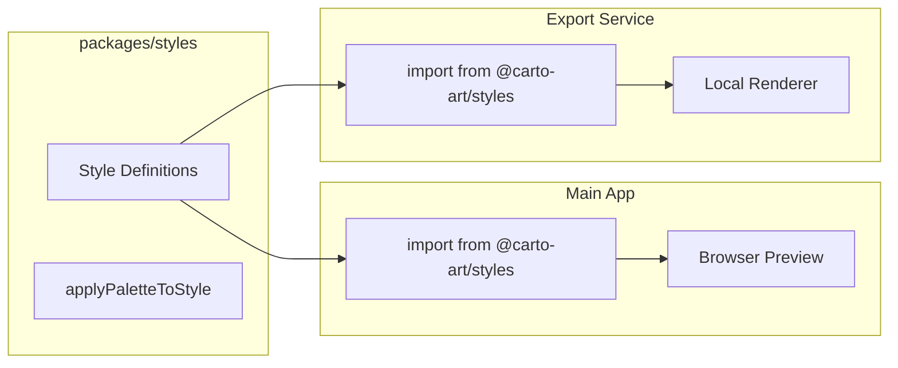

# Self-Contained Export Service - Implementation Plan

## Overview

This plan details the implementation of a fully self-contained headless export service that:
- Fully offloads rendering resources from the main app
- Guarantees style consistency via shared packages
- Operates independently of the main app

## Architecture

```mermaid
graph TB
    subgraph "Client"
        WebApp[Web App]
        API[API Clients]
    end
    
    subgraph "Main App - Vercel"
        APIGateway[API Gateway]
        Auth[Auth Middleware]
        JobSubmit[Job Submission]
    end
    
    subgraph "Export Service - Self-Contained"
        Queue[Job Queue]
        Worker[Export Worker]
        LocalRenderer[Local Renderer Page]
        Browser[Puppeteer/Chromium]
        SharedStyles[Shared Styles Package]
        Storage[Supabase Client]
    end
    
    subgraph "Shared Packages"
        Types[@carto-art/types]
        Styles[@carto-art/styles]
    end
    
    subgraph "External"
        Tiles[Map Tile Servers]
        Supabase[Supabase Storage]
    end
    
    WebApp --> APIGateway
    API --> APIGateway
    APIGateway --> Auth
    Auth --> JobSubmit
    JobSubmit -->|Enqueue Job| Queue
    Queue --> Worker
    Worker --> Browser
    Browser -->|localhost| LocalRenderer
    LocalRenderer --> SharedStyles
    SharedStyles -.->|imports| Styles
    Browser -->|Fetch tiles| Tiles
    Worker --> Storage
    Storage --> Supabase
```

## Project Structure

```
carto-art/
├── apps/
│   ├── web/                          # Next.js main app - existing
│   │   ├── app/
│   │   ├── lib/
│   │   │   └── styles/
│   │   │       └── index.ts          # Re-exports from @carto-art/styles
│   │   └── package.json
│   │
│   └── export-service/               # NEW: Self-contained export service
│       ├── src/
│       │   ├── index.ts              # Service entry point
│       │   ├── api/
│       │   │   ├── health.ts         # Health check endpoint
│       │   │   └── jobs.ts           # Job status endpoint
│       │   ├── queue/
│       │   │   ├── queue.ts          # BullMQ queue setup
│       │   │   └── worker.ts         # Job processor
│       │   ├── rendering/
│       │   │   ├── renderer.ts       # Puppeteer orchestration
│       │   │   └── browser-pool.ts   # Browser instance management
│       │   ├── renderer-app/         # Local renderer - Vite + React
│       │   │   ├── index.html
│       │   │   ├── main.tsx
│       │   │   ├── RendererPage.tsx  # Extracted from app/renderer/page.tsx
│       │   │   └── vite.config.ts
│       │   └── storage/
│       │       └── supabase.ts       # Storage client
│       ├── Dockerfile
│       ├── package.json
│       └── tsconfig.json
│
└── packages/
    ├── types/                        # Shared TypeScript types
    │   ├── src/
    │   │   ├── poster.ts             # PosterConfig, ColorPalette, etc.
    │   │   └── index.ts
    │   ├── package.json
    │   └── tsconfig.json
    │
    ├── styles/                       # Shared map styles
    │   ├── src/
    │   │   ├── index.ts              # Style exports
    │   │   ├── minimal.ts
    │   │   ├── dark-mode.ts
    │   │   ├── blueprint.ts
    │   │   ├── vintage.ts
    │   │   ├── topographic.ts
    │   │   ├── watercolor.ts
    │   │   ├── midnight.ts
    │   │   ├── abstract.ts
    │   │   ├── atmospheric.ts
    │   │   ├── organic.ts
    │   │   ├── retro.ts
    │   │   └── applyPalette.ts       # Palette application logic
    │   ├── package.json
    │   └── tsconfig.json
    │
    └── export-utils/                 # Shared export utilities
        ├── src/
        │   ├── exportCanvas.ts       # Canvas composition
        │   ├── drawing.ts            # Drawing utilities
        │   ├── text-overlay.ts       # Text rendering
        │   └── index.ts
        ├── package.json
        └── tsconfig.json
```

## Implementation Phases

### Phase 1: Monorepo Setup (Week 1)

**Goal**: Set up monorepo structure with shared packages

**Tasks**:
1. Initialize Turborepo or Nx monorepo
2. Create `packages/types/` with extracted types
3. Create `packages/styles/` with extracted styles
4. Update main app to import from shared packages
5. Verify main app still works

**Deliverables**:
- Working monorepo structure
- Shared packages published locally
- Main app using shared packages

**Files to Create**:
```
packages/types/package.json
packages/types/src/poster.ts
packages/types/src/index.ts
packages/styles/package.json
packages/styles/src/index.ts
packages/styles/src/*.ts (all style files)
```

### Phase 2: Export Service Scaffold (Week 2)

**Goal**: Create basic export service with local renderer

**Tasks**:
1. Create `apps/export-service/` directory
2. Set up Express server with health endpoint
3. Create local renderer app (Vite + React)
4. Extract `RendererPage.tsx` from main app
5. Verify renderer works locally

**Deliverables**:
- Export service running locally
- Local renderer page functional
- Health check endpoint working

**Key Files**:
```typescript
// apps/export-service/src/index.ts
import express from 'express';
import { createServer as createViteServer } from 'vite';

const app = express();

// Serve local renderer app
const vite = await createViteServer({
  server: { middlewareMode: true },
  appType: 'spa',
});
app.use(vite.middlewares);

// Health check
app.get('/health', (req, res) => {
  res.json({ status: 'ok' });
});

app.listen(3001);
```

### Phase 3: Rendering Pipeline (Week 3)

**Goal**: Implement Puppeteer rendering with browser pool

**Tasks**:
1. Implement browser pool management
2. Create rendering orchestration
3. Integrate with local renderer
4. Add Supabase storage client
5. Test end-to-end rendering

**Deliverables**:
- Browser pool functional
- Rendering pipeline working
- Storage upload working

**Key Files**:
```typescript
// apps/export-service/src/rendering/renderer.ts
import { getBrowser } from './browser-pool';
import type { PosterConfig } from '@carto-art/types';

export async function renderExport(config: PosterConfig): Promise<Buffer> {
  const browser = await getBrowser();
  const page = await browser.newPage();
  
  // Navigate to LOCAL renderer (not main app)
  await page.goto('http://localhost:3001/renderer');
  
  // Inject config
  await page.evaluate((cfg) => window.renderPoster(cfg), config);
  
  // Wait for render
  await page.waitForSelector('#render-complete');
  
  // Capture
  const base64 = await page.evaluate(() => 
    window.generatePosterImage({ width: 2400, height: 3600, dpi: 72, name: 'export' })
  );
  
  return Buffer.from(base64, 'base64');
}
```

### Phase 4: Job Queue Integration (Week 4)

**Goal**: Add BullMQ job queue for async processing

**Tasks**:
1. Set up Redis connection
2. Create BullMQ queue and worker
3. Implement job status tracking
4. Add retry logic and error handling
5. Create job status API endpoint

**Deliverables**:
- Job queue functional
- Worker processing jobs
- Status API working

**Key Files**:
```typescript
// apps/export-service/src/queue/worker.ts
import { Worker } from 'bullmq';
import { renderExport } from '../rendering/renderer';
import { uploadToSupabase } from '../storage/supabase';

const worker = new Worker('exports', async (job) => {
  const { config, resolution } = job.data;
  
  // Update progress
  await job.updateProgress(10);
  
  // Render
  const buffer = await renderExport(config);
  await job.updateProgress(80);
  
  // Upload
  const url = await uploadToSupabase(buffer, job.id);
  await job.updateProgress(100);
  
  return { url, size: buffer.length };
}, {
  connection: { host: process.env.REDIS_HOST },
  concurrency: 5,
});
```

### Phase 5: Main App Integration (Week 5)

**Goal**: Connect main app to export service

**Tasks**:
1. Update `/api/v1/posters/generate` to enqueue jobs
2. Add job status polling endpoint
3. Update client-side export flow
4. Add webhook support (optional)
5. Test end-to-end flow

**Deliverables**:
- Main app submitting jobs to export service
- Async export flow working
- Client receiving results

**Key Files**:
```typescript
// apps/web/app/api/v1/posters/generate/route.ts
import { NextRequest, NextResponse } from 'next/server';

export async function POST(req: NextRequest) {
  // ... auth and validation ...
  
  // Submit job to export service
  const response = await fetch(process.env.EXPORT_SERVICE_URL + '/jobs', {
    method: 'POST',
    headers: { 'Content-Type': 'application/json' },
    body: JSON.stringify({ config, resolution }),
  });
  
  const { jobId } = await response.json();
  
  return NextResponse.json({
    job_id: jobId,
    status: 'queued',
    status_url: '/api/v1/posters/jobs/' + jobId,
  });
}
```

### Phase 6: Deployment (Week 6)

**Goal**: Deploy export service to production

**Tasks**:
1. Create Dockerfile for export service
2. Set up Redis instance (managed or self-hosted)
3. Deploy to cloud provider (Railway, Render, or VPS)
4. Configure environment variables
5. Set up monitoring and logging

**Deliverables**:
- Export service deployed
- Redis running
- Monitoring in place

**Dockerfile**:
```dockerfile
FROM node:20-slim

# Install Chromium dependencies
RUN apt-get update && apt-get install -y \
    chromium \
    fonts-liberation \
    libasound2 \
    libatk-bridge2.0-0 \
    libatk1.0-0 \
    libcups2 \
    libdbus-1-3 \
    libdrm2 \
    libgbm1 \
    libgtk-3-0 \
    libnspr4 \
    libnss3 \
    libxcomposite1 \
    libxdamage1 \
    libxfixes3 \
    libxrandr2 \
    xdg-utils \
    --no-install-recommends \
    && rm -rf /var/lib/apt/lists/*

ENV PUPPETEER_SKIP_CHROMIUM_DOWNLOAD=true
ENV PUPPETEER_EXECUTABLE_PATH=/usr/bin/chromium

WORKDIR /app
COPY package*.json ./
RUN npm ci --only=production

COPY . .
RUN npm run build

EXPOSE 3001
CMD ["node", "dist/index.js"]
```

### Phase 7: Testing and Optimization (Week 7-8)

**Goal**: Ensure reliability and performance

**Tasks**:
1. Visual regression testing (compare exports)
2. Load testing (concurrent exports)
3. Memory leak testing
4. Performance optimization
5. Documentation

**Deliverables**:
- Test suite passing
- Performance benchmarks
- Documentation complete

## Style Consistency Guarantee

### How Styles Stay Consistent



**Key Points**:
1. **Single source of truth**: `packages/styles/` contains all style definitions
2. **Same import**: Both apps import from `@carto-art/styles`
3. **Same code**: `applyPaletteToStyle()` is shared
4. **Same rendering**: Both use MapLibre GL with identical configuration

### Verification Process

1. **Automated visual regression tests**: Compare preview screenshots to export outputs
2. **Hash comparison**: Generate style hashes to detect drift
3. **CI/CD checks**: Fail builds if styles diverge

## Resource Requirements

### Export Service Server

| Resource | Minimum | Recommended |
|----------|---------|-------------|
| CPU | 2 cores | 4 cores |
| RAM | 4 GB | 8 GB |
| Storage | 10 GB | 20 GB |
| Network | 100 Mbps | 1 Gbps |

### Redis

| Resource | Minimum | Recommended |
|----------|---------|-------------|
| RAM | 256 MB | 1 GB |
| Storage | 1 GB | 5 GB |

### Estimated Costs

| Service | Provider | Monthly Cost |
|---------|----------|--------------|
| Export Service | Railway/Render | $20-50 |
| Redis | Upstash/Railway | $10-20 |
| **Total** | | **$30-70** |

## Risk Mitigation

| Risk | Mitigation |
|------|------------|
| Style drift | Shared package + visual regression tests |
| Memory leaks | Browser pool with instance limits |
| Queue bottleneck | Auto-scaling workers |
| Service downtime | Health checks + auto-restart |
| Tile loading failures | Retry logic + timeout handling |

## Success Criteria

1. **Style consistency**: 100% visual match between preview and export
2. **Performance**: Average render time < 30 seconds
3. **Reliability**: 99.5% success rate
4. **Scalability**: Handle 50+ concurrent exports
5. **Independence**: Main app unaffected by export load

## Next Steps

1. Review and approve this plan
2. Set up monorepo structure
3. Extract shared packages
4. Create export service scaffold
5. Implement rendering pipeline
6. Deploy and test

---

**Document Version**: 1.0  
**Last Updated**: 2026-01-17  
**Status**: Ready for Implementation
