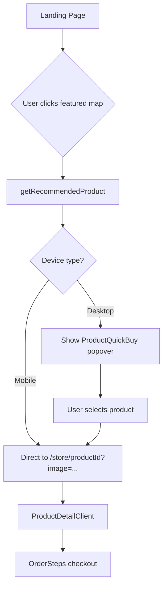

# Store UI/UX Overhaul & Featured Product Marketing

## Executive Summary

Comprehensive overhaul of the store pages (`/store`, `/store-home`, `/store/[productId]`) with a focus on:
1. **Conversion optimization** - Streamlined path from landing page to checkout
2. **Visual modernization** - Premium boutique feel with better product presentation
3. **Mobile-first redesign** - Touch-friendly, responsive experience
4. **Featured product marketing** - Auto-select and promote one product per featured map on landing page

---

## Current State Analysis

### Store Architecture
```
Landing Page (/)
    └── FeaturedMaps section → /store?image=...
    
/store-home
    └── StoreHomePageClient → FeaturedProductCard (cycles through maps)
    
/store
    └── ProductCard grid → /store/[productId]
    
/store/[productId]
    └── ProductDetailClient → OrderSteps (3-step checkout)
```

### Key Files
| File | Purpose |
|------|---------|
| [`app/page.tsx`](../app/page.tsx) | Landing page with FeaturedMaps |
| [`components/landing/FeaturedMaps.tsx`](../components/landing/FeaturedMaps.tsx) | Featured maps section |
| [`app/store/page.tsx`](../app/store/page.tsx) | Product selection page |
| [`app/store/[productId]/page.tsx`](../app/store/[productId]/page.tsx) | Product detail page |
| [`app/store-home/page.tsx`](../app/store-home/page.tsx) | Featured products landing |
| [`components/store/ProductCard.tsx`](../components/store/ProductCard.tsx) | Product card component |
| [`components/store/FeaturedProductCard.tsx`](../components/store/FeaturedProductCard.tsx) | Featured product card |
| [`components/ecommerce/OrderSteps.tsx`](../components/ecommerce/OrderSteps.tsx) | 3-step checkout flow |
| [`lib/actions/featured-maps.ts`](../lib/actions/featured-maps.ts) | Featured maps data |
| [`lib/utils/store.ts`](../lib/utils/store.ts) | Store utilities |

### Product Types
| ID | Title | Use Case |
|----|-------|----------|
| 1 | Framed Poster | Premium city grids, portrait maps |
| 2 | Poster | Standard prints, budget option |
| 3 | Canvas | Panoramic landscapes, wide maps |

### Current Pain Points
1. Generic "Buy Print" CTA on landing page - no product specificity
2. No 1:1 featured product per map relationship
3. Store pages functional but not conversion-optimized
4. Mobile experience needs improvement
5. No price visibility until deep in funnel

---

## Proposed Solution

### 1. Featured Product Auto-Selection Logic

Create a utility to automatically select the best product type based on map image characteristics:

```typescript
// lib/utils/featured-product-selection.ts

interface ProductRecommendation {
  productId: number;
  productTitle: string;
  reason: string;
  startingPrice: number;
}

export async function getRecommendedProduct(
  imageUrl: string,
  products: ProductGroup[]
): Promise<ProductRecommendation> {
  // 1. Fetch image dimensions (can use HEAD request or image probe)
  const dimensions = await getImageDimensions(imageUrl);
  
  // 2. Calculate aspect ratio
  const aspectRatio = dimensions.width / dimensions.height;
  
  // 3. Apply selection logic
  if (aspectRatio > 1.5) {
    // Wide/panoramic → Canvas
    return findProduct(products, 3, 'Panoramic format ideal for canvas');
  } else if (aspectRatio < 0.8) {
    // Tall/portrait → Framed Poster
    return findProduct(products, 1, 'Portrait format perfect for framing');
  } else {
    // Square-ish → Standard Poster
    return findProduct(products, 2, 'Classic format for poster prints');
  }
}
```

### 2. Landing Page FeaturedMaps Enhancement

#### Mobile View (Direct CTA)
```
┌─────────────────────────────┐
│  [Map Image]                │
│                             │
│  Tokyo Night                │
│  Stunning city grid...      │
│                             │
│  ┌─────────────────────────┐│
│  │ Buy as Canvas - $89     ││
│  │ [Arrow Icon]            ││
│  └─────────────────────────┘│
└─────────────────────────────┘
```

#### Desktop View (Mini Product Selector on Hover)
```
┌─────────────────────────────────────────┐
│  [Map Image]                            │
│                                         │
│  ┌─────────────────────────────────┐    │
│  │ Quick Buy                       │    │
│  │ ┌───────────────────────────┐   │    │
│  │ │ ★ Canvas        from $89  │   │    │
│  │ └───────────────────────────┘   │    │
│  │ ┌───────────────────────────┐   │    │
│  │ │   Framed Poster  from $79 │   │    │
│  │ └───────────────────────────┘   │    │
│  │ ┌───────────────────────────┐   │    │
│  │ │   Poster         from $39 │   │    │
│  │ └───────────────────────────┘   │    │
│  └─────────────────────────────────┘    │
│                                         │
│  Tokyo Night                            │
│  Stunning city grid visualization       │
└─────────────────────────────────────────┘
```

### 3. Store Pages UI Overhaul

#### `/store` - Product Selection Page

**Current:** Basic grid of product cards
**Proposed:**
- Hero section with value proposition
- Product cards with lifestyle imagery
- Quick comparison table
- Trust signals (reviews, guarantees)
- Sticky mobile CTA

```
┌─────────────────────────────────────────────────────────┐
│  Bring Your Map to Life                                 │
│  Choose the perfect format for your custom design       │
│                                                         │
│  ┌─────────────┐  ┌─────────────┐  ┌─────────────┐     │
│  │ [Canvas]    │  │ [Framed]    │  │ [Poster]    │     │
│  │             │  │             │  │             │     │
│  │ Canvas      │  │ Framed      │  │ Poster      │     │
│  │ from $89    │  │ from $79    │  │ from $39    │     │
│  │ [View →]    │  │ [View →]    │  │ [View →]    │     │
│  └─────────────┘  └─────────────┘  └─────────────┘     │
│                                                         │
│  ┌─────────────────────────────────────────────────┐   │
│  │ Compare Products                                │   │
│  │ ─────────────────────────────────────────────── │   │
│  │ Feature      Canvas    Framed    Poster         │   │
│  │ Material     Gallery   Matte     Matte          │   │
│  │ Frame        N/A       Black     N/A            │   │
│  │ Best For     Panoramic Portrait  Budget         │   │
│  └─────────────────────────────────────────────────┘   │
└─────────────────────────────────────────────────────────┘
```

#### `/store/[productId]` - Product Detail & Checkout

**Current:** OrderSteps with 3 steps (Size → Shipping → Payment)
**Proposed:**
- Larger product preview with zoom
- Size selector with visual comparison
- Real-time price updates
- Progress indicator improvements
- Mobile-optimized form layout

```
┌─────────────────────────────────────────────────────────┐
│  ← Back                    [1]──[2]──[3]                │
│                            Size  Ship  Pay              │
│                                                         │
│  ┌───────────────────────┐  ┌─────────────────────────┐│
│  │                       │  │ Canvas Print            ││
│  │   [Large Preview]     │  │                         ││
│  │                       │  │ Select Size:            ││
│  │                       │  │ ┌─────┐ ┌─────┐ ┌─────┐ ││
│  │                       │  │ │12x16│ │18x24│ │24x36│ ││
│  │                       │  │ │ $89 │ │$129 │ │$179 │ ││
│  │                       │  │ └─────┘ └─────┘ └─────┘ ││
│  │                       │  │                         ││
│  └───────────────────────┘  │ ┌─────────────────────┐ ││
│                             │ │ Continue to Shipping│ ││
│                             │ └─────────────────────┘ ││
│                             └─────────────────────────┘│
└─────────────────────────────────────────────────────────┘
```

### 4. Mobile-First Improvements

#### Touch-Friendly Product Cards
- Larger tap targets (min 44px)
- Swipe gestures for size selection
- Bottom sheet for product details

#### Sticky Price/CTA
```
┌─────────────────────────────┐
│  [Scrollable Content]       │
│                             │
│                             │
├─────────────────────────────┤
│  Canvas 18x24    $129       │
│  [Add to Cart]              │
└─────────────────────────────┘
```

#### Simplified Variant Selection
- Visual size comparison (silhouette overlay)
- Swipeable size cards
- Clear price per size

---

## Technical Implementation

### New Components

```
components/
├── store/
│   ├── ProductQuickBuy.tsx        # Mini product selector popover
│   ├── ProductComparisonTable.tsx # Feature comparison
│   ├── SizeSelector.tsx           # Visual size picker
│   ├── MobileStickyCart.tsx       # Sticky bottom CTA
│   └── ProductHero.tsx            # Store page hero section
├── landing/
│   └── FeaturedMapCard.tsx        # Enhanced featured map card
└── ui/
    └── BottomSheet.tsx            # Mobile bottom sheet
```

### New Utilities

```
lib/
└── utils/
    ├── featured-product-selection.ts  # Auto-selection logic
    └── image-dimensions.ts            # Image dimension fetching
```

### Data Flow



### API Changes

None required - all logic is client-side using existing product data.

### Database Changes

None required - featured product selection is computed, not stored.

---

## Implementation Checklist

### Phase 1: Featured Product Auto-Selection
- [ ] Create `lib/utils/featured-product-selection.ts`
- [ ] Create `lib/utils/image-dimensions.ts`
- [ ] Add unit tests for selection logic

### Phase 2: Landing Page Enhancement
- [ ] Create `components/store/ProductQuickBuy.tsx`
- [ ] Update `components/landing/FeaturedMaps.tsx`
- [ ] Add responsive behavior (mobile direct CTA, desktop popover)
- [ ] Add analytics tracking for product selection

### Phase 3: Store Page Overhaul
- [ ] Create `components/store/ProductHero.tsx`
- [ ] Create `components/store/ProductComparisonTable.tsx`
- [ ] Update `app/store/page.tsx` layout
- [ ] Modernize `components/store/ProductCard.tsx`

### Phase 4: Product Detail Enhancement
- [ ] Create `components/store/SizeSelector.tsx`
- [ ] Update `components/ecommerce/OrderSteps.tsx`
- [ ] Improve preview/mockup presentation
- [ ] Add real-time price updates

### Phase 5: Mobile Optimization
- [ ] Create `components/store/MobileStickyCart.tsx`
- [ ] Create `components/ui/BottomSheet.tsx`
- [ ] Add touch gestures for size selection
- [ ] Optimize image loading and skeletons
- [ ] Test on various mobile devices

### Phase 6: Polish & Testing
- [ ] Add loading states and error handling
- [ ] Implement analytics events
- [ ] Cross-browser testing
- [ ] Performance optimization
- [ ] A/B test setup for conversion tracking

---

## Success Metrics

| Metric | Current | Target |
|--------|---------|--------|
| Landing → Store CTR | TBD | +30% |
| Store → Checkout Rate | TBD | +25% |
| Mobile Conversion | TBD | +40% |
| Time to Purchase | TBD | -20% |

---

## Risk Mitigation

| Risk | Mitigation |
|------|------------|
| Image dimension fetch fails | Fallback to default product (Poster) |
| Breaking existing checkout | Feature flag for gradual rollout |
| Mobile performance | Lazy load components, optimize images |
| SEO impact | Maintain existing URL structure |

---

## Dependencies

- Existing product data from `getProducts()` and `getMarginAdjustedVariants()`
- Featured maps from `getActiveFeaturedMaps()`
- Stripe checkout integration (unchanged)
- Printful mockup generation (unchanged)

---

## Timeline Estimate

| Phase | Scope |
|-------|-------|
| Phase 1 | Featured product auto-selection utility |
| Phase 2 | Landing page FeaturedMaps enhancement |
| Phase 3 | Store page UI overhaul |
| Phase 4 | Product detail page improvements |
| Phase 5 | Mobile optimization |
| Phase 6 | Polish, testing, and rollout |

---

## Appendix: Component Specifications

### ProductQuickBuy Component

```typescript
interface ProductQuickBuyProps {
  featuredMap: FeaturedMap;
  products: ProductGroup[];
  recommendedProductId: number;
  onSelect: (productId: number) => void;
}
```

**Behavior:**
- Shows on hover (desktop) or tap (mobile)
- Highlights recommended product with star icon
- Shows starting price for each product
- Clicking product navigates to `/store/[productId]?image=...`

### SizeSelector Component

```typescript
interface SizeSelectorProps {
  variants: ProductVariant[];
  selectedVariantId: number;
  onSelect: (variant: ProductVariant) => void;
  designUrl: string;
}
```

**Behavior:**
- Visual grid of size options
- Shows mockup preview for each size
- Highlights selected size
- Displays price prominently
- Swipeable on mobile

### MobileStickyCart Component

```typescript
interface MobileStickyCartProps {
  product: ProductGroup;
  selectedVariant: ProductVariant;
  onContinue: () => void;
}
```

**Behavior:**
- Fixed to bottom of viewport on mobile
- Shows product name, size, and price
- Primary CTA button
- Hides when scrolled to top
- Animates in/out smoothly
